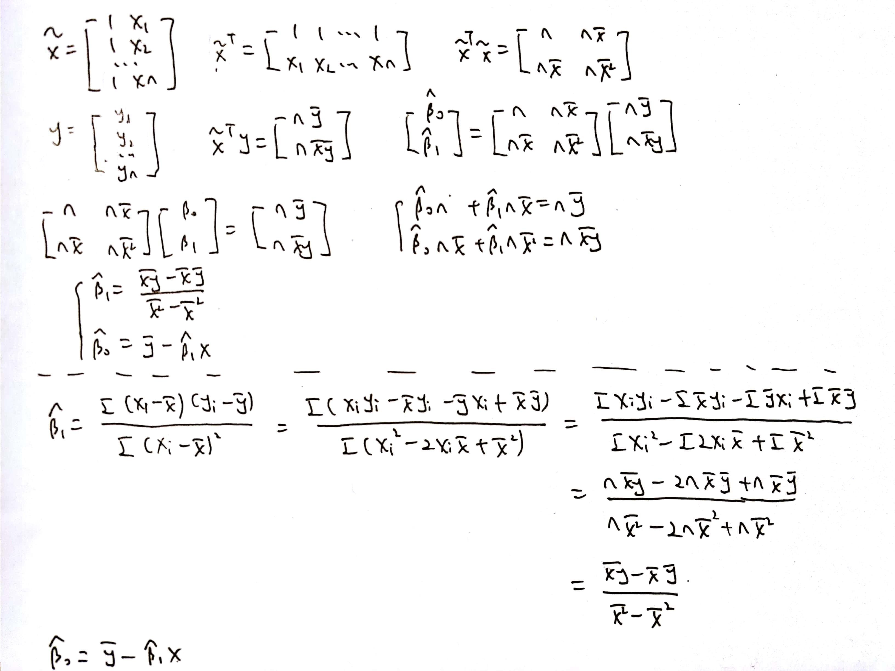
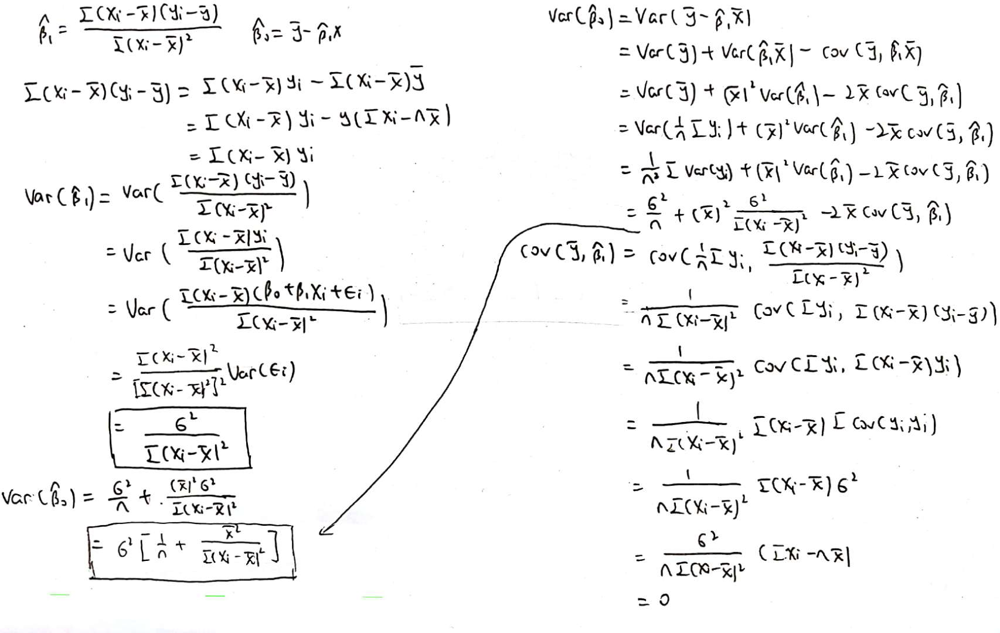

```{r setup, include=FALSE}
knitr::opts_chunk$set(echo = TRUE)
```

## Problem 1
####(a)

$RSS_{12}=\sum (y-\beta_0x-\beta_1x-\beta_2x^2)^2$, $RSS_1=\sum (y-\beta_0x-\beta_1x)^2$

In order to fit the model nicely, we should find $\beta_0, \beta_1, \beta_2$ to make the RSS smallest. 

If $\beta_2=0$, $RSS_{12}=RSS_1$.

If $\beta_2\neq0$, which means we can find some group of $\beta_0, \beta_1, \beta_2$ to make the RSS smaller then only two $\beta_0, \beta_1$ (the 3-dimension can find more smaller value than 2-dimension), thus $RSS_{12}\leq RSS_1$

####(b)

$R^2=1-RSS/TSS$, and $TSS=\sum (y-\bar{y})$, which is the same for both fomula. $RSS_{12}\leq RSS_1$, thus $R^2_{12}\geq R^2_1$

## Problem 2

The null hyphothesis for TV is that the TV advertising have no effect on sales in the presence of radio advertising and newspaper advertising. 

The null hyphothesis for radio is that the radio advertising have no effect on sales in the presence of TV advertising and newspaper advertising. 

The null hyphothesis for newspaper is that the newspaper advertising have no effect on sales in the presence of radio advertising and TV advertising. 

The high p-value of newspaper suggests that the null hypothesis is true for newspaper. The low p-values of TV and radio suggest that the null hypotheses are false for TV and radio.  

## Problem 3



## Problem 4
####(a)

```{r}
library(ISLR)
data("Auto")
summary(lm(mpg ~ cylinders, data = Auto))
summary(lm(mpg ~ displacement, data = Auto))
summary(lm(mpg ~ horsepower, data = Auto))
summary(lm(mpg ~ weight, data = Auto))
summary(lm(mpg ~ acceleration, data = Auto))
summary(lm(mpg ~ as.factor(year), data = Auto))
summary(lm(mpg ~ as.factor(origin), data = Auto))
```

(i) There is a relationship between all the predictors and response because the p-value for all predictors are very small.

(ii) The weight predictor has a statistically significant relationship to the response because the R-squared of this model is the biggest among all predictors models.

(iii) The first coefficient means that the miles per gallon will be 17.6897 when the year is 70, and the coefficient below the first one is unit the miles per gallon will change according to the year(for example: if the year is 71, the miles per gallon will increase by 3.4215 and if the year is 72, the miles per gallon will increase by 1.0246...)

####(b)

```{r}
summary(lm(mpg ~ horsepower, data = Auto))
summary(lm(mpg ~ horsepower + I(horsepower ^ 2), data = Auto))
summary(lm(mpg ~ horsepower + I(horsepower ^ 2) + I(horsepower ^ 3), data = Auto))
```

The $R^2$ of the second model increase significantly while the $R^2$ of the third model increase slightly. Thus the second model is better because it can fit the model better and not overfitting.

```{r}
lm.1 = lm(mpg ~ horsepower + I(horsepower ^ 2), data = Auto)
plot(Auto$horsepower, Auto$mpg, xlab = "horsepower", ylab = "mpg")
x = seq(min(Auto$horsepower), max(Auto$horsepower), 0.01)
y.fit = lm.1$coeff[1] + lm.1$coeff[2] * x + lm.1$coeff[3] * x ^ 2
points(x, y.fit, col = "red", type = "l")
legend('topright','fitted function', col = "red", lty = 1)
```

####(c)

```{r}
summary(lm(mpg ~ horsepower + as.factor(origin) + horsepower : as.factor(origin), data = Auto)) 
```

The miles per gallon will be 34.476496 when horsepower is zero and origin is American.

For American origin, the miles per gallon will change by -0.121320 with 1 unit change of horsepower.

For European origin, the miles per gallon will change by (-0.121320-0.100515) with 1 unit change of horsepower.

For Japanese origin, the miles per gallon will change by (-0.121320-0.108723) with 1 unit change of horsepower.

If the origin is America, the miles per gallon will not change.

If the origin is European, the miles per gallon will change by 10.997230 - 0.100515 * horsepower.

If the origin is Japanese, the miles per gallon will change by 14.339718 - 0.108723 * horsepower.

## Problem 5
####(a)

balance = $\beta_0$ + $\beta_1*$income + $\beta_2*$graduate + $\beta_3*$undergraduate

If the person is a graduate student, the balance will change by $\beta_2$.

If the person is an undergraduate student, the balance will change by $\beta_3$.

If the person is not a student, the balance will not change.

balance change by $\beta_1$ with 1 unit change of income.

balance is $\beta_0$ if the income is zero and the person is not a student.

####(b)

balance = $\beta_0$ + $\beta_1*$income + $\beta_2*$not student + $\beta_3*$graduate

If the person is a graduate student, the balance will change by $\beta_3$.

If the person is an undergraduate student, the balance will not change.

If the person is not a student, the balance will change by $\beta_2$.

balance change by $\beta_1$ with 1 unit change of income.

balance is $\beta_0$ if the income is zero and the person is an undergraduate student.

####(c)

balance = $\beta_0$ + $\beta_1*$income + $\beta_2*$graduate + $\beta_3*$undergraduate + $\beta_4*$income $*$ graduate + $\beta_5*$income $*$ undergraduate

For graduate student, the balance change by $\beta_1+\beta_4$ with 1 unit change of income.

For undergraduate student, the balance change by $\beta_1+\beta_5$ with 1 unit change of income.

For not student, the balance change by $\beta_1$ with 1 unit change of income.

If the person is a graduate student, the balance will change by $\beta_2$ + $\beta_4*$income.

If the person is an undergraduate student, the balance will change by $\beta_3$ + $\beta_5*$income.

If the person is not a student, the balance will not change.

balance is $\beta_0$ if the income is zero and the person is not a student.

####(d)

balance = $\beta_0$ + $\beta_1*$income + $\beta_2*$not student + $\beta_3*$graduate + $\beta_4*$income $*$ not student + $\beta_5*$income $*$ graduate

For graduate student, the balance change by $\beta_1+\beta_5$ with 1 unit change of income.

For undergraduate student, the balance change by $\beta_1$ with 1 unit change of income.

For not student, the balance change by $\beta_1+\beta_4$ with 1 unit change of income.

If the person is a graduate student, the balance will change by $\beta_3$ + $\beta_5*$income.

If the person is an undergraduate student, the balance will not change.

If the person is not a student, the balance will change by $\beta_2$ + $\beta_4*$income.

####(e)

```{r}
set.seed(123)
balance = rnorm(100, 1000, 100)
income = rnorm(100, 30000, 500)
student = numeric(100)
for(i in 1:100){
  student[i] = sample(c("graduate", "undergraduate", "not student"), size = 1)
}
dummy1 = numeric(100)
dummy2 = numeric(100)
for(i in 1:100) {
  if (student[i] == "graduate") {
    dummy1[i] = 1
  }
  if (student[i] == "undergraduate") {
    dummy2[i] = 1
  }
}
lm.1 = lm(balance ~ income + dummy1 + dummy2)
y1.fit = lm.1$coeff[1] + income * lm.1$coeff[2] + dummy1 * lm.1$coeff[3] + dummy2 * lm.1$coeff[4]
lm.3 = lm(balance ~ income + dummy1 + dummy2 + income : dummy1 + income : dummy2)
y3.fit = lm.3$coeff[1] + income * lm.3$coeff[2] + dummy1 * lm.3$coeff[3] + dummy2 * lm.3$coeff[4] + income * dummy1 * lm.3$coeff[5] + income * dummy2 * lm.3$coeff[6]
dummy1 = numeric(100)
dummy2 = numeric(100)
for(i in 1:100) {
  if (student[i] == "graduate") {
    dummy2[i] = 1
  }
  if (student[i] == "not student") {
    dummy1[i] = 1
  }
}
lm.2 = lm(balance ~ income + dummy1 + dummy2)
y2.fit = lm.2$coeff[1] + income * lm.2$coeff[2] + dummy1 * lm.2$coeff[3] + dummy2 * lm.2$coeff[4]
lm.4 = lm(balance ~ income + dummy1 + dummy2 + income : dummy1 + income : dummy2)
y4.fit = lm.4$coeff[1] + income * lm.4$coeff[2] + dummy1 * lm.4$coeff[3] + dummy2 * lm.4$coeff[4] + income * dummy1 * lm.4$coeff[5] + income * dummy2 * lm.4$coeff[6]
plot(y1.fit, y2.fit)
abline(0, 1)
plot(y3.fit, y4.fit)
abline(0, 1)
```

The plot shows that the y1.fit and y2.fit are equal, y3.fit and y4.fit are equal, which means that the fitted values (predictions) from the models in do not depend on the coding of the dummy variables.

## Problem 6


