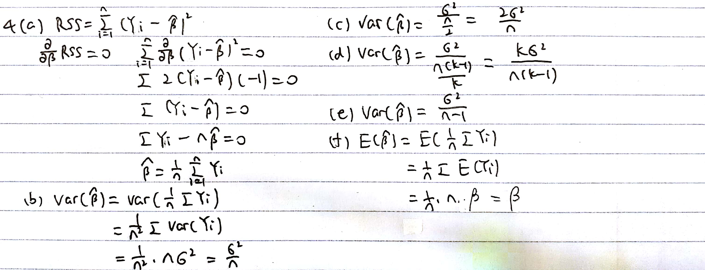
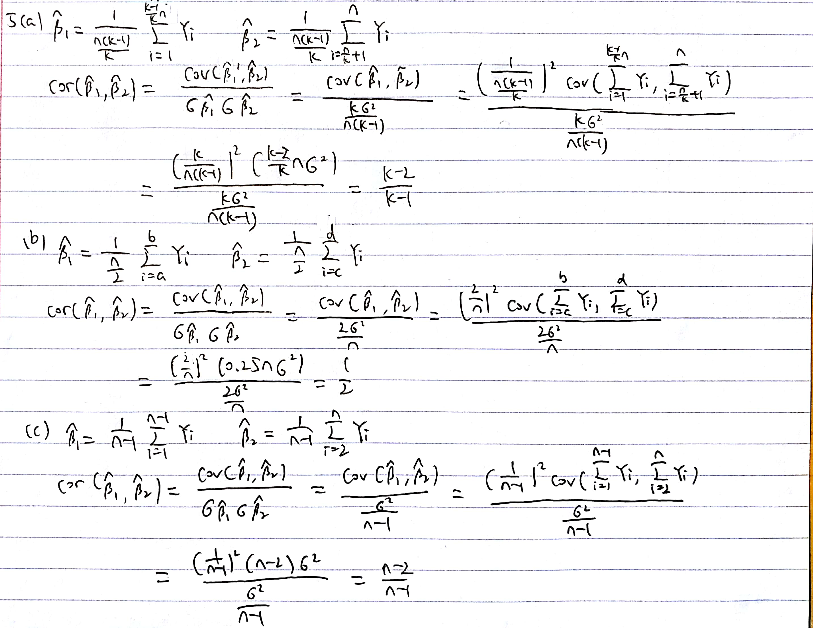

```{r setup, include=FALSE}
knitr::opts_chunk$set(echo = TRUE)
```

## Problem 1

####(a)

The probability an observation was chosen in training set is $\frac{50}{100}=\frac{1}{2}$. Since the two times validation set approach are independent, the probability an observation was chosen in both training sets is $\frac{1}{2}^2=\frac{1}{4}$.

####(b)

I will not get the same result each time. Because validation set approach randomly divided the data set into two parts, a training set and a validation set and each time we repeat the validation set approach, we will get a different training set and validation set. Thus, I will get different result each time.

## Problem 2

####(a)

The probability an observation was chosen in 1st fold's training set is $\frac{k-1}{k}$. The probability an observation was chosen in 2nd fold's training set is $\frac{k-2}{k-1}$. Thus, the probability an observation was chosen in both training sets is $\frac{k-2}{k}$.

####(b)

I will not get the same result each time. Because k-fold CV randomly divided the data in k folds and use each folds as validation data once a time and get k group of test errors, and the result of the k-fold CV is the average of these k test errors. Each time we repeat the k-fold CV, we will get different split of data into k folds. Thus, I will get different result each time.

## Problem 3

####(a)

The probability an observation was chosen in 1st fold's training set is $\frac{n-1}{n}$. The probability an observation was chosen in 2nd fold's training set is $\frac{n-2}{n-1}$. Thus, the probability an observation was chosen in both training sets is $\frac{n-2}{n}$.

####(b)

I will get the same result each time. Because the LOOCV will select each observations as validation data once a time and get n group of test errors, and the result of the LOOCV is the average of these n test errors. Thus, there is no randomness in the training/validation set splits and I will get same result each time.

## Problem 4

####(a,b,c,d,e,f)



####(g)

According to the answer in (b) and (c), the validation set approach that use $\frac{n}{2}$ observations will have $Var(\hat{\beta})= \frac{2\sigma^2}{n}$, which is much larger than $Var(\hat{\beta})=\frac{\sigma}{n}$ that using all $n$ observations. Also, the excepted test error is $E[(Y-\hat{\beta})^2]=Var(\hat{\beta})+(E[\hat{\beta}-\beta])^2+\sigma^2$. According to the answer in (f), $E[\hat{\beta}]$ is unrelated to the number of observation and is 0 in both case. And the validation set approach have a higher $Var(\hat{\beta})$. Thus, the validation set approach tends to over-estimate the expected test error.

####(h)

According to the answer in (b) and (e), the LOOCV that use $n-1$ observations will have $Var(\hat{\beta})= \frac{\sigma^2}{n-1}$, which is nearly the same as $Var(\hat{\beta})=\frac{\sigma}{n}$ that using all $n$ observations when n is large. Also, the excepted test error is $E[(Y-\hat{\beta})^2]=Var(\hat{\beta})+(E[\hat{\beta}-\beta])^2+\sigma^2$. According to the answer in (f), $E[\hat{\beta}]$ is unrelated to the number of observation and is 0 in both case. And the LOOCV have nearly the same $Var(\hat{\beta})$. Thus, leave-one-out cross-validation does not substantially over-estimate the expected test error, provided that n is large.

####(g)

According to the answer in (b) and (d), the k-fold CV that use $\frac{n(k-1)}{k}$ observations will have $Var(\hat{\beta})= \frac{k\sigma^2}{n(k-1)}$, which is between the $Var(\hat{\beta})$ of the validation set approach and LOOCV. Also, the excepted test error is $E[(Y-\hat{\beta})^2]=Var(\hat{\beta})+(E[\hat{\beta}-\beta])^2+\sigma^2$. According to the answer in (f), $E[\hat{\beta}]$ is unrelated to the number of observation and is 0 . And the k-fold CV have $Var(\hat{\beta})$ between the validation set approach and LOOCV. Thus, K-fold CV provides an over-estimate of the expected test error that is somewhere between the big over-estimate resulting from the validation set approach and the very mild over-estimate resulting from leave-one-out CV.

## Problem 5


