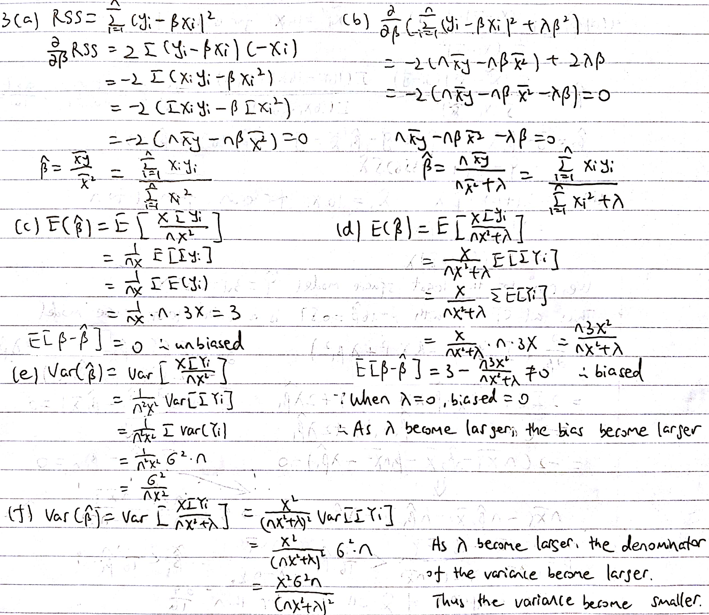
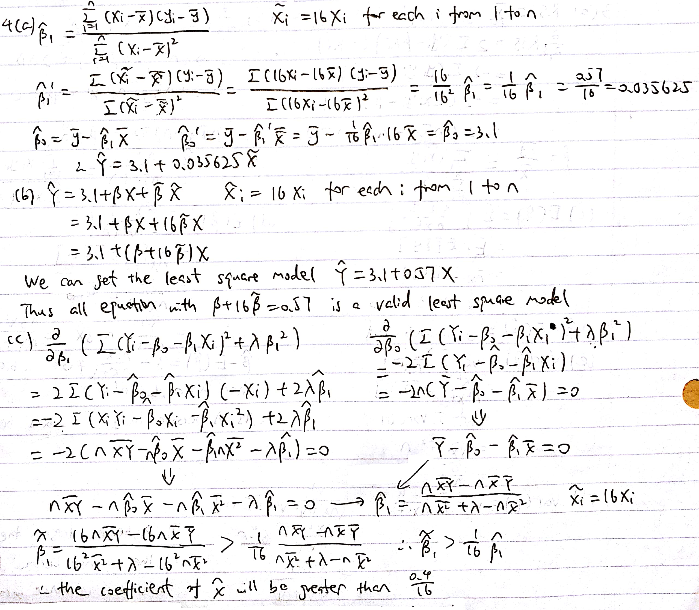
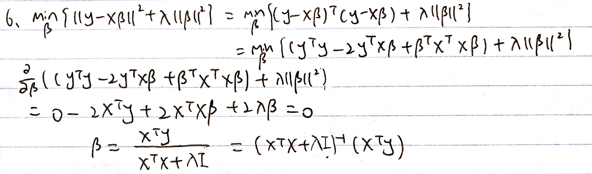

```{r setup, include=FALSE}
knitr::opts_chunk$set(echo = TRUE)
```

## Problem 1

####(a)

```{r}
set.seed(123)
X = rnorm(100, 5, 3)
error = rnorm(100, 0, 2)
```

####(b)

```{r}
Y = 3 - 2 * X + X ^ 2 + error
```

####(c)

```{r}
library(leaps)
data = data.frame(X, X ^ 2, X ^ 3, X ^ 4, X ^ 5, X ^ 6, X ^ 7, Y)
best = regsubsets(Y ~ ., data)
best.summary = summary(best)
par(mfrow = c(1, 3))
plot(best.summary$cp, xlab = "Number of Variables", ylab = "Cp", type = 'l')
which.min(best.summary$cp)
points(2, best.summary$cp[2], col = "red", cex = 2, pch = 20)
plot(best.summary$bic, xlab = "Number of Variables", ylab = "BIC", type = 'l')
which.min(best.summary$bic)
points(2, best.summary$bic[2], col = "red", cex = 2, pch = 20)
plot(best.summary$adjr2, xlab = "Number of Variables", ylab = "Adjusted RSq", type = 'l')
which.max(best.summary$adjr2)
points(2, best.summary$adjr2[2], col = "red", cex = 2, pch = 20)
coef(best, 2)
```

The overall best model according to Cp, BIC and adjusted $R^2$ is the one that contains two variables ($Y=2.55-1.82X+0.98X^2$). The coefficients of the best model obtained is 2.55, -1.82 and 0.98

####(d)

```{r}
forward = regsubsets(Y ~ ., data, method = "forward")
forward.summary = summary(forward)
par(mfrow = c(1, 3))
plot(forward.summary$cp, xlab = "Number of Variables", ylab = "Cp", type = 'l')
which.min(forward.summary$cp)
points(2, forward.summary$cp[2], col = "red", cex = 2, pch = 20)
plot(forward.summary$bic, xlab = "Number of Variables", ylab = "BIC", type = 'l')
which.min(forward.summary$bic)
points(2, forward.summary$bic[2], col = "red", cex = 2, pch = 20)
plot(forward.summary$adjr2, xlab = "Number of Variables", ylab = "Adjusted RSq", type = 'l')
which.max(forward.summary$adjr2)
points(2, forward.summary$adjr2[2], col = "red", cex = 2, pch = 20)
coef(forward, 2)
```

The overall best model according to Cp, BIC and adjusted $R^2$ is the one that contains two variables ($Y=2.55-1.82X+0.98X^2$). The coefficients of the best model obtained is 2.55, -1.82 and 0.98


####(e)

```{r}
back = regsubsets(Y ~ ., data, method = "backward")
back.summary = summary(back)
par(mfrow = c(1, 3))
plot(back.summary$cp, xlab = "Number of Variables", ylab = "Cp", type = 'l')
which.min(back.summary$cp)
points(2, back.summary$cp[2], col = "red", cex = 2, pch = 20)
plot(back.summary$bic, xlab = "Number of Variables", ylab = "BIC", type = 'l')
which.min(back.summary$bic)
points(2, back.summary$bic[2], col = "red", cex = 2, pch = 20)
plot(back.summary$adjr2, xlab = "Number of Variables", ylab = "Adjusted RSq", type = 'l')
which.max(back.summary$adjr2)
points(2, back.summary$adjr2[2], col = "red", cex = 2, pch = 20)
coef(back, 2)
```

The overall best model according to Cp, BIC and adjusted $R^2$ is the one that contains two variables ($Y=2.55-1.82X+0.98X^2$). The coefficients of the best model obtained is 2.55, -1.82 and 0.98

## Problem 2

####(a)

```{r}
set.seed(123)
X = matrix(0, 1000, 100)
for (i in 1:100) {
  X[, i] = rnorm(1000, i, 3)
}
error = rnorm(1000, 0, 3)
```

####(b)

```{r}
Y = 5 + error
```

####(c)

```{r}
hist((summary(lm(Y ~ X)))$coef[, 4][2:101], xlab ="p-value", main = "Histogram of p-value")
```

####(d)

No feature appear to be signifcantly associated with the response because the histogram of the p-value seemed like the shape of an uniform distribution.

####(e)

```{r}
data = data.frame(X, Y)
forward = regsubsets(Y ~ .,data, method = "forward")
coef(forward, 2)
(summary(lm(Y ~ X[, 43] + X[, 46])))$coef[, 4]
```

The p-value obtained for the coefficients are 0.009 and 0.004

####(f)

```{r}
set.seed(1234)
for (i in 1:100) {
  X[, i] = rnorm(1000, 100 + i, 3)
}
(summary(lm(Y ~ X[, 43] + X[, 46])))$coef[, 4]
```

The p-value obtained for the coefficients are 0.867 and 0.065. They are much higher than the p-value in (e)

####(g)

No, they are not associated with the response. Because the p-value for the coefficients are become much larger when the observations changed. Thus the small value in part (d) are just accidental, which means the feature are not significant associated with the response.

## Problem 3

####(a,b,c,d,e,f)



####(g)

According to the answer in (d) and (f), as $\lambda$ become larger, the bias of the ridge estimator become larger and the variance of the ridge estimator become smaller, which exactly correspond with bias-variance trade-off. For the reasone that the test MSE is the sum of squared bias, variance and irreducible error, the $\lambda$ in ridge regression allows us to control model complexity by trading of bias for variance.

## Problem 4

####(a,b,c)



####(d)

The ridge regression to predict $Y$ using $\tilde{X}$ will have a smaller RSS. Because the $\beta_{1}$ for the ridge regression using $\tilde{X}$ is smaller than the ridge using $\tilde{X}$, which means the penalty will be smaller. According to the bia-varicance trade of the penalty of the ridge regression, as the penalty decrease, the bias will be decrease and variance will be increase. Thus the RSS will be decrease because the bias is decrease.

####(e)

The following claim is false. Because the ridge regression have penalty related with $\beta_{1}$. According to the answer in (c), the $\tilde{\beta_{1}}$ is not exactly $\frac{\beta_{1}}{16}$. To make this form to be true, the penalty should not be changed, which means the $\tilde{\beta_{1}}$ should be exactly $\frac{\beta_{1}}{16}$. Thus the following claim is false.

####(f)

According to the answer in answer in (a) and (c), we can find that the $\beta_{1}$ change is not exactly proportion to the scare change when we use the ridge regression, while the $\beta_{1}$ change is exactly proportion to the scare change when we use the least square. And from the answer to (d), we conclude that the RSS will change if the scare change when we use the ridge regression. According to the part (b) and (e), we find that the ridge regression cannot be hold if we just change the proportion simply. Thus the least squares is scale-invariant, but ridge regression is not. 

## Problem 5

####(a)

less than or equal to

Because the model of the predictor is one. According to the forward stepwise selection, when k = 1, it gives the best model by adding 1 predictor to the null models. However, the backward stepwise selection may not give the best model when k = 1, because the predictor must be chosen from the predictors when k = 2, which predictors must be chosen from predictors when k = 3.... If the true best predictors when k = 1 are deleted before, then it will never give the best model. Thus the RSS of forward is less than or equal to RSS from backward.

####(b)

equal to

Because they are both null models, which contain no predictors. Thus the models are same and RSS are same.

####(c)

equal to

Because the number of the predictor is one. According to the forward stepwise selection, when k = 1, it gives the best model by adding 1 predictor to the null models. Also, the best subset selection always gives the best model when k = 1. Thus the models are same and RSS are same.

####(d)

less than or equal to

According to the answer in (c), the RSS of forward selection when k = 1 are equal to the RSS of best selection when k = 1. Also, the RSS will become smaller or remain unchange when the predictor increase. Thus the RSS of forward selection when k = 2 are less than or equal to the RSS of best selection when k = 1.

####(e)

greater than or equal to

According to the answer in (a) and (c), the RSS of forward selection when k = 1 are equal to the RSS of best subset selection when k = 1 and the RSS of forward when k = 1 is less than or equal to RSS from backward when k = 1. Thus, the RSS of backward when k = 1 are greater than or equal to the RSS of best subset selection when k = 1.

####(f)

equal to

Because they are both full model which contain all p predictors. Thus the model are same and the RSS are same.

####(g)

equal to

Beacuse the number of predictors are p-1. According to backward stepwise selection, when k = p - 1, it gives the best model by delete one predictors from full model. Also, the best subset selection always gives the best model when k = p - 1. Thus the models are same and RSS are same.

####(h)

greater than or equal to

The backward stepwise selection may not give the best model when k = 4 because the predictors must be chosen from the predictors when k = 5, which predictors must be chosen from predictors when k = 6....If the true best preditors when k = 4 are deleted before, it will never get the best model. However, the best subset selection always gives the best model. Thus the RSS of backward when k = 4 is greater than or equal to best subset when k = 4.

####(i)

not enough information to tell

According to the forward stepwise selection and backward stepwise selection, they may neither give the best model when k = 4 if the predictors of the best model is not added before or deleted before. Thus, we cannot decided which one gives the best model or no one gives the best, and we also cannot decide the relationship of their RSS.

####(j)

less than or equal to

As the predictor increase, the RSS will remain same of become smaller. Thus the RSS of backward when k = 4 is less than or equal to the RSS of backward when k = 3.

## Problem 6


