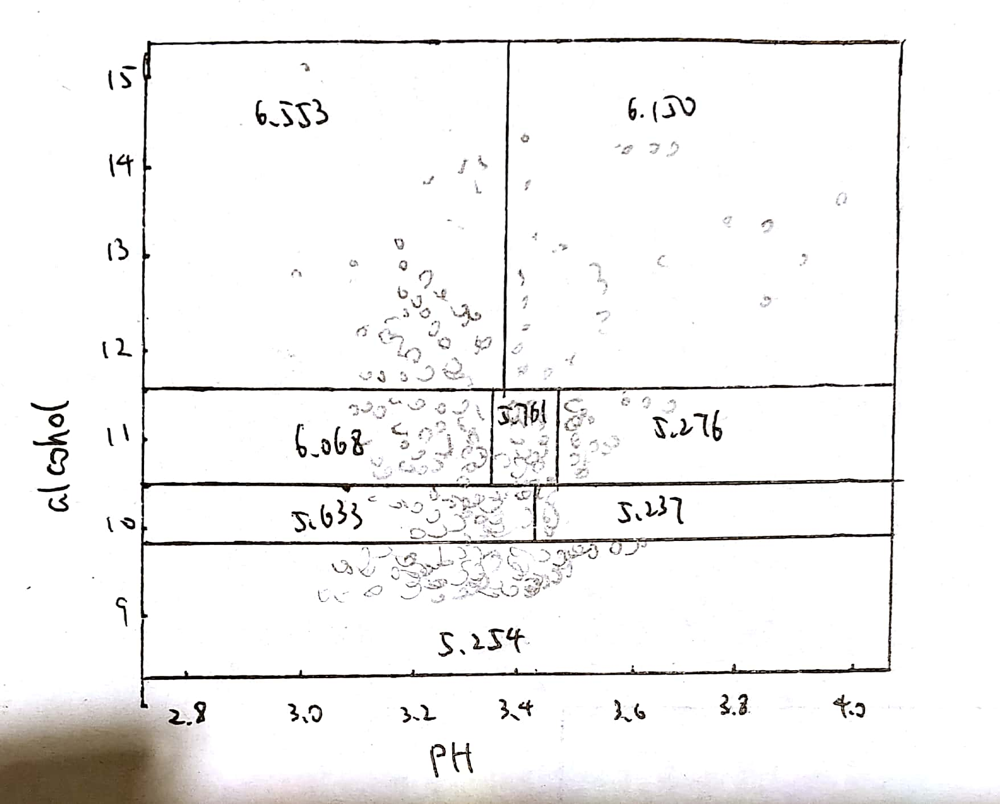
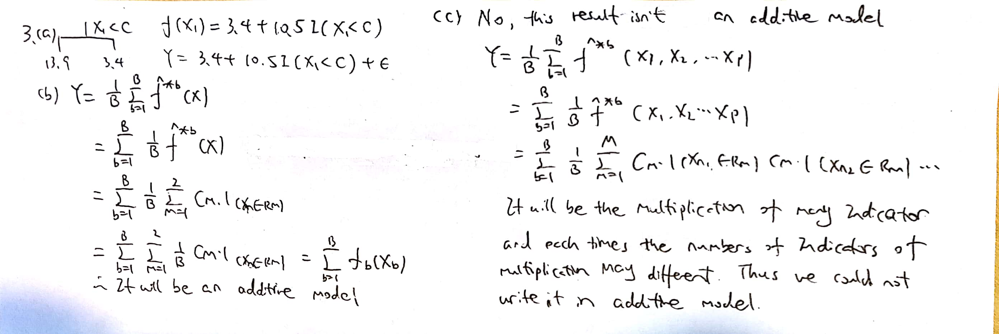

```{r setup, include=FALSE}
knitr::opts_chunk$set(echo = TRUE)
```

## Problem 1

####(a)

```{r}
dat = read.csv("D:\\class\\STAT435\\homework 8\\wine.csv", sep = ";", header = T)
```

I get this data from UCI machine learning repository. This data is about the wine¡¯s physicochemical feature. The response Y is the quality of the wine. The features x1 is the fixed acidity of the wine, x2 is the volatile acidity of the wine, x3 is the citric acid of the wine, x4 is the residual sugar of the wine, x5 is the chlorides of the wine, x6 is the free sulfur dioxide of the wine, x7 is the total sulfur dioxide of the wine, x8 is the density of the wine, x9 is the pH of the wine, x10 is the sulphates of the wine, x11 is the alcohol of the wine. All 11 features are quantitative. The value of n is 18 and the value of p is 11.

####(b)

```{r}
library(tree)
tree.1 = tree(quality ~ ., data = dat)
plot(tree.1)
text(tree.1, pretty = 0)
pred = predict(tree.1)
mean((pred - dat$quality)^2)
```

The RSS on the training data is 0.4254908.

####(c)

```{r}
prune.1 = prune.tree(tree.1, best = 6)
plot(prune.1)
text(prune.1, pretty = 0)
pred = predict(prune.1)
mean((pred - dat$quality)^2)
```

The RSS on the training data is 0.4479022, and it is larger than the RSS obtained in (b). It is because when we pruning the tree, the bias of the tree will increase and the variance of the tree will decrease. Thus the RSS on training data is increase.

####(d)

```{r}
cv.1 = cv.tree(tree.1, FUN = prune.tree)
plot(cv.1$size, cv.1$dev, type = 'b', xlab = "tree size", ylab = "cross-validation error rate")
```

####(e)

```{r}
prune.2 = prune.tree(tree.1, best = 8)
plot(prune.2)
text(prune.2, pretty = 0)
pred = predict(prune.2)
mean((pred - dat$quality)^2)
```

The RSS on the training data is 0.4254908.

####(f)

```{r}
library(randomForest)
dat1 = dat[1:1000, ]
dat2 = dat[1001:1599, ]
bag.1 = randomForest(quality ~ ., data = dat1, mtry = 11, importance  = TRUE)
pred = predict(bag.1, newdata = dat2)
mean((dat2$quality - pred)^2)
```

The test error of the bagging is 0.433504.

####(g)

```{r}
rf.1 = randomForest(quality ~ ., data = dat1, importance  = TRUE)
pred = predict(rf.1, newdata = dat2)
mean((dat2$quality - pred)^2)
```

The test error of the random forest is 0.4290314

####(h)

```{r}
tree.2 = tree(quality ~ ., data = dat1)
prune.3 = prune.tree(tree.2, best = 8)
pred = predict(prune.3, newdata = dat2)
mean((pred - dat2$quality)^2)
```

The test error of the regression tree is 0.5217263. The test error of the bagging is 0.433504. The test error of the random forest is 0.4290314. The random forest result in the smallest test error. It is because that the bagging can reduce the variance and hence increase the accuracy of prediction of the regression tree and the random forest can improvement over bagged trees by way of a small tweak that decorrelates the trees, which will make the variance even smaller. Thus the random forest will give the smallest test error.

## Problem 2

####(a)

I just use the data from question with the response Y be the queslity of the wine and features x1 be the alcohol of the wine and feature x2 be the pH of the wine.

####(b)

```{r}
tree.2 = tree(quality ~ alcohol + pH, data = dat, control = tree.control(nobs = 1599, mindev = 0))
prune.3 = prune.tree(tree.2, best = 8)
plot(prune.3)
text(prune.3, pretty = 0)
```

####(c)



## Problem 3



## Problem 4

####(a)

The variance of the irreducible error is the variance of $\epsilon$, which is 1.

####(b)

$f(x_1,x_2)=x_1+x_2, Y=x_1+x_2+\epsilon$

Because the relationship between the features and response is approximated linear, which means least square regression will likely work well, and will outperform regression tree that does not exploit this linear structure.

####(c)

```{r}
library(tree)
set.seed(1)
x1 = sample((seq(0, 10, len = 1000)))
x2 = sample((seq(0, 10, len = 1000)))
eps = rnorm(1000)
y = x1 + x2 + eps
dat = data.frame(x1, x2, y)
dat1 = dat[1:600, ]
dat2 = dat[601:1000, ]
lm.1 = lm(y ~ x1 + x2, data = dat1)
pred = predict(lm.1, newdata = dat2)
e = mean((dat2$y - pred) ^ 2)
tree.1 = tree(y ~ x1 + x2, data = dat1)
err = numeric(10)
for(i in 2:10) {
  prune = prune.tree(tree.1, best = i)
  pred = predict(prune, newdata = dat2)
  err[i] = mean((dat2$y - pred) ^ 2)
}
plot(2:10, err[2:10], ylim = c(0, 14), type = 'b', xlab = "tree size", ylab = "test error")
abline(h = e)
```

####(d)

$f(x_1,x_2)=I(x_1<5)+I(x_2<5), Y=I(x_1<5)+I(x_2<5)+\epsilon$

Because the relationship between the features and response are highly non-linear, the least squared regression is not perform well and fit data badly, while regression tree can preform the complex relationship between response and features.

####(e)

```{r}
y = I(x1 < 5) + I(x2 < 5) + eps
dat = data.frame(x1, x2, y)
dat1 = dat[1:600, ]
dat2 = dat[601:1000, ]
lm.1 = lm(y ~ x1 + x2, data = dat1)
pred = predict(lm.1, newdata = dat2)
e = mean((dat2$y - pred) ^ 2)
tree.1 = tree(y ~ x1 + x2, data = dat1, control = tree.control(nobs = 600, mindev = 0))
err = numeric(10)
for(i in 2:10) {
  prune = prune.tree(tree.1, best = i)
  pred = predict(prune, newdata = dat2)
  err[i] = mean((dat2$y - pred) ^ 2)
}
plot(2:10, err[2:10], type = 'b', xlab = "tree size", ylab = "test error")
abline(h = e)
```
